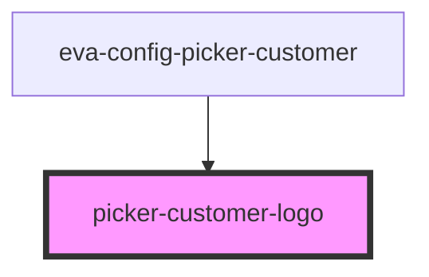

# picker-customer-logo

<!-- Auto Generated Below -->

## Properties

| Property       | Attribute       | Description | Type     | Default     |
| -------------- | --------------- | ----------- | -------- | ----------- |
| `customerName` | `customer-name` |             | `string` | `undefined` |
| `logoPath`     | `logo-path`     |             | `string` | `undefined` |

## Dependencies

### Used by

 - [eva-config-picker-customer](../picker-customers)

### Graph

----------------------------------------------

*Built with [StencilJS](https://stenciljs.com/)*
