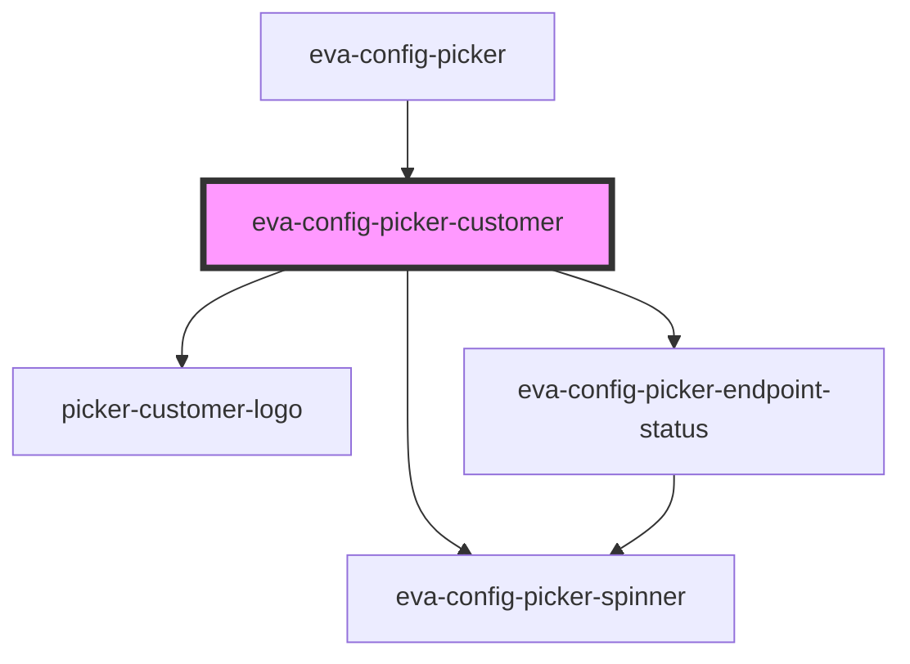

# eva-config-picker-customer

<!-- Auto Generated Below -->

## Events

| Event            | Description                                     | Type                           |
| ---------------- | ----------------------------------------------- | ------------------------------ |
| `endPointSelect` | This will emit whenever an endpoint is selected | `CustomEvent<BaseEnvironment>` |

## Dependencies

### Used by

 - [eva-config-picker](../picker)

### Depends on

- [eva-config-picker-spinner](../picker-spinner)
- [picker-customer-logo](../picker-customer-logo)
- [eva-config-picker-endpoint-status](../picker-endpoint-status)

### Graph

----------------------------------------------

*Built with [StencilJS](https://stenciljs.com/)*
