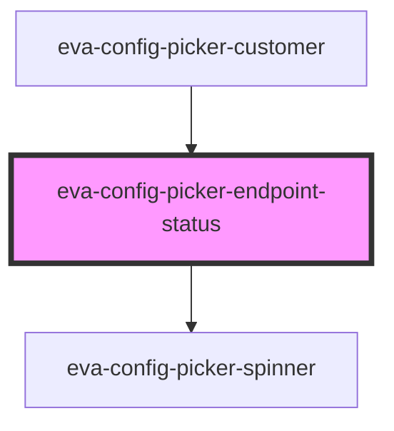

# eva-config-picker-endpoint-status

<!-- Auto Generated Below -->

## Properties

| Property   | Attribute  | Description | Type     | Default     |
| ---------- | ---------- | ----------- | -------- | ----------- |
| `endpoint` | `endpoint` |             | `string` | `undefined` |

## Dependencies

### Used by

 - [eva-config-picker-customer](../picker-customers)

### Depends on

- [eva-config-picker-spinner](../picker-spinner)

### Graph

----------------------------------------------

*Built with [StencilJS](https://stenciljs.com/)*
